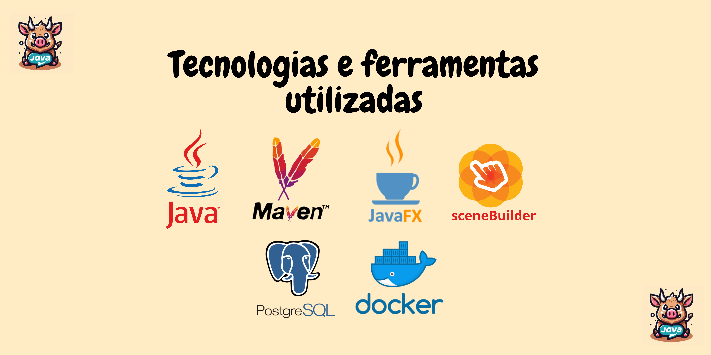
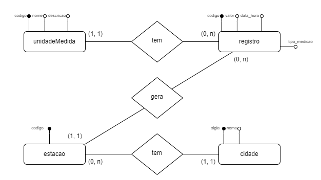

# Javali

Trabalho de API do 2º semestre da FATEC.

## Desafio
Ter um bom entendimento do clima de uma região é imprescindível para o planejamento de atividades em várias áreas. Por exemplo, conhecer a temperatura e umidade média em determinados períodos do ano pode influenciar na escolha do que plantar em uma fazenda.
Atualmente, existem diversas bases de dados públicas que fornecem essas informações na forma de arquivos CSV. Entretanto, existem diversos arquivos para uma mesma cidade (um para cada estação de monitoramento) que, dependendo do tipo da estação, podem apresentara diferentes formatos.
Com base no exposto, gostaríamos de um Sistema de Banco de Dados capaz de receber esses arquivos, validar seu conteúdo e prover relatórios.

## Objetivos 
### 🤖 Competências
- o Projetar Banco de Dados relacional com múltiplas entidades e relacionamentos;
- o Organizar Equipes por Competências;
- o Levantar e Registrar Requisitos Funcionais e Não Funcionais usando técnicas de Métodos Ágeis e Tradicionais;
- o Projetar Arquitetura Lógica do Sistema;
- o Implementar Aplicação (com persistência) usando Linguagem de Programação Java Desktop.
### 🤖 Tecnologias
- o Linguagem Java Desktop e conexão com Banco de Dados usando JDBC;
- o Banco de Dados modelo Relacional;
- o Git.

### 🤖 Requisitos Funcionais
- Relatório de valor médio das variáveis climáticas por cidade. Deve ser possível escolher uma cidade e um período de tempo. O relatório deve ter periodicidade horária (um registro a cada hora);
- Relatório de situação, apresentando os valores médios das últimas medidas para cada cidade;
- Gerenciamento de estações, cidades e unidades de medida. Deve ser possível visualizar e alterar informações sobre esses elementos do sistema. Cada estação está localizada em uma cidade do estado de SP. Cada variável climática medida possui uma unidade de medida;
-  Carregamento e validação de arquivos CSV contendo variáveis climáticas. Registros suspeitos (exemplo: registro com temperatura acima de 60 graus Celsius ou inferior a -20 graus Celsius) devem ser armazenados a parte para revisão manual. Cada arquivo possui registros de apenas uma estação (referenciada no nome do arquivo). Cada registro apresenta valores para todas as variáveis, mas elas devem ser armazenadas separadamente (um registro para temperatura, outro para umidade, etc, em vez de um único registro contendo temperatura, umidade, etc);
-  Tratamento de registros suspeitos, que permita exclusão ou revisão. Deve ser possível alterar os valores e passá-los à base de dados principal ou excluí-los.
  
### 🤖 Requisitos Não Funcionais
- Linguagem Java;
- Banco de Dados Relacional;
- Documentação: manual de usuário, diagrama entidade-relacionamento e instruções de instalação.

### 🤖 Prazos

| Sprints | Início | Fim |
| ------- | ------ | --- |
| 1ª sprint | 25/03 | 14/04 |
| 2ª sprint | 15/04 | 05/05 |
| 3ª sprint | 06/05 | 26/05 |
| 4ª sprint | 27/05 | 16/06 |
| Feira de Soluções | 27/06 | 27/06 |

### 🤖 Priorização das Sprints
[Board Kanbam com a priorização](https://github.com/orgs/Javali-FATEC/projects/1)

Ao abrir os cards do kanbam será possível ver a priorização no lado direito como um dos atributos dos cards.

# Produto

### Backlog
| **Como**    | **Eu quero**                                                                                           | **Valor**                                                                                | **Prioridade** | **Sprint** | **Status** |
|-------------|--------------------------------------------------------------------------------------------------------|------------------------------------------------------------------------------------------|----------------|------------|------------|
| Pesquisador | Interpretar um documento CSV que contem dados metereólogicos                                           | Facilitar a leitura dos documentos das estações                                          | Alta           | 1          | Finalizado   |
| Pesquisador | Gerar relatórios de valor médio das variáveis climáticas por cidade                                    | Agilidade na leitura e na interpretação de dados uteis envolvendo uma analise da cidade  | Alta           | 2          | Pendente   |
| Pesquisador | Gerar relatório de situação                                                                            | Agilidade em obter os dados relacionados relacionados a situação atual                   | Alta           | 2          | Pendente   |
| Pesquisador | Gerar relatório para se plotar um gráfico boxplot                                                      | Agilidade em obter os dados para plottar um gráfico util para analise de dados           | Alta           | 3          | Pendente   |
| Pesquisador | Gerenciar valores limites a serem utilizados como parametro para definir valores de risco nas medições | Ter valores possivelmente suspeitos de acordo com a nescessidade                         | Média          | 3          | Pendente   |
| Pesquisador | Alterar valores de risco nas medições                                                                  | Manter dados com melhor verificação em todos os relatórios                               | Média          | 4          | Pendente   |
| Pesquisador | Gerir as cidades e as estações, tal como a relações entre estação e cidade                             | Informações mais completas e personalizadas sobre as estações e cidades                  | Baixa          | 4          | Pendente   |
| Pesquisador | Gerir as unidades de medida usadas no sistema.                                                         | Informações mais completas referente as unidades usadas no relatóro                      | Baixa          | 4          | Pendente   |

### Tecnologias e Ferramentas Utilizadas

### Modelo Entidade relação

### Como configurar e rodar o projeto localmente

🚧🔨 Em Construção 🔧🚧
👷‍♂️ Estamos trabalhando duro para trazer todas as informações! 💪✨ 

### Wireframe do Produto

[Wireframe](readme_assets/API.pdf)

## Equipe

Integrante | Linkedin
 -----------|---------|
Vinícius Augusto da Silva Monteiro  | [link](https://www.linkedin.com/in/viniciusvasm/) |
Ricardo Campos    |[link](https://www.linkedin.com/in/ricardo-campos-ba56091b5/)|
Elbert Jean  |[link](https://www.linkedin.com/in/elbert-jean-1757b017b/)|
Isaque Souza |[link](https://www.linkedin.com/in/isaque-souza-6760b8270/)|
Maria Clara  |[link](https://www.linkedin.com/in/c137santos/)|
Marília Borgo   |[link](https://www.linkedin.com/in/mariliaborgo/)|
Paloma Soares  |[link](https://www.linkedin.com/in/paloma-soares-83a949208/)|
Aguinaldo Junior | [link]
