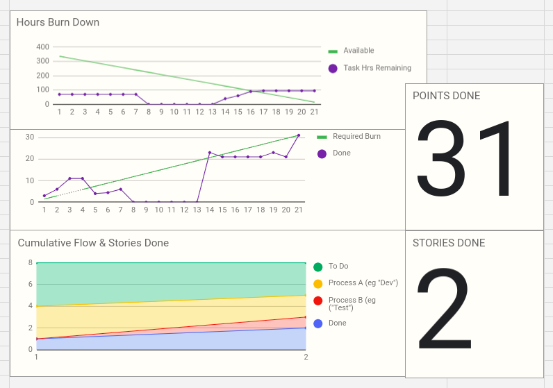

# Burndown

O burndown é uma ferramenta fundamental no gerenciamento ágil de projetos, especialmente no framework Scrum. Ele é uma representação visual do progresso do trabalho ao longo do tempo, mostrando quanto trabalho resta para ser concluído em relação ao tempo disponível.

## Burndown - Sprint dois (15/04 - 05/05)
